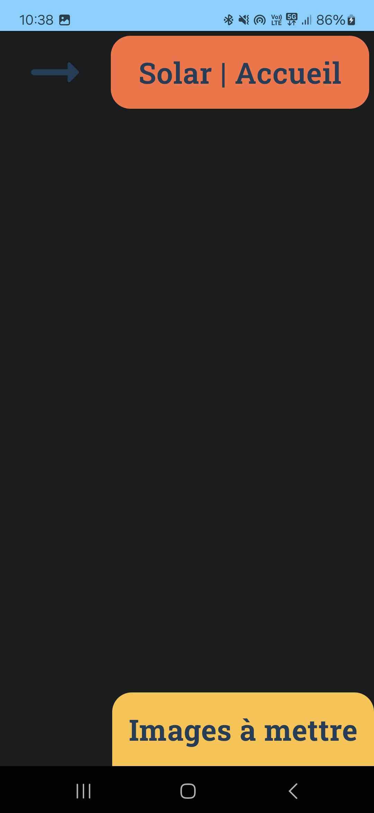
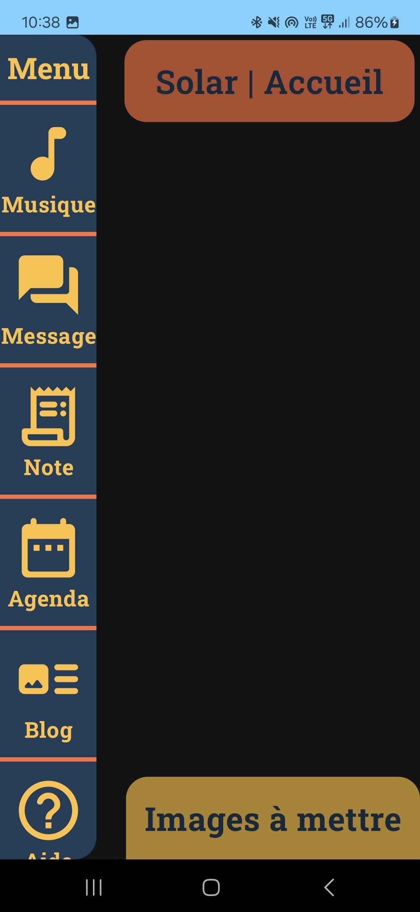
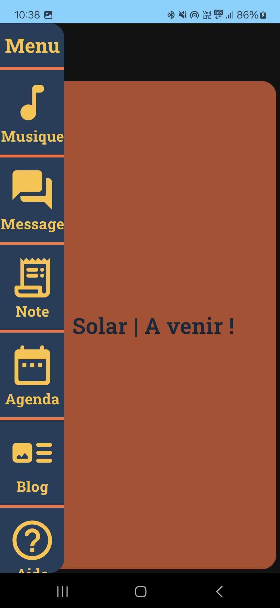
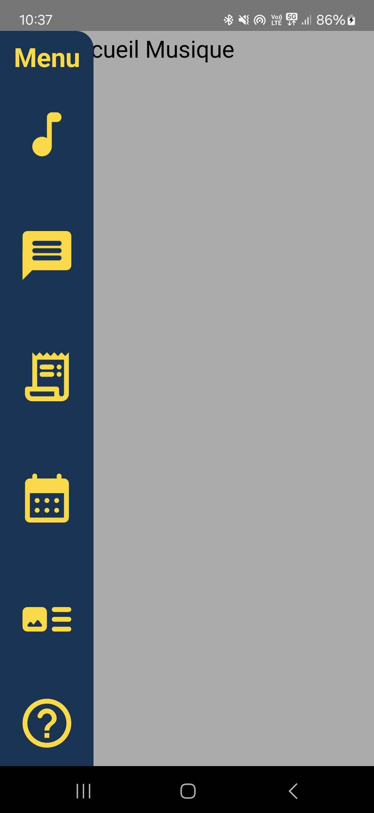
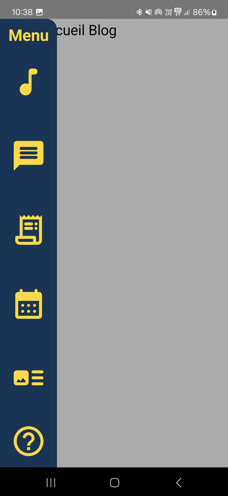

# Perso_Appli_Mobile_Musique

Il s'agit de mon projet Jetpack Compose. J'ai perdu tout mes travaux sur le précédent et je tente de le recréer. Il est actuellement en construction, il s'agit d'une application mobile Jetpack compose de musique !

## Ancienne version

## Avancement de la reconstruction

## Crédit :
[Philippe Teva](https://github.com/TevaPhilippe05)

Mention spéciale :
[Noah Penin](https://github.com/enteraname74) <- Étudiant en Master 2  l'USMB qui m'a aidé à me lancer sur Kotlin.
